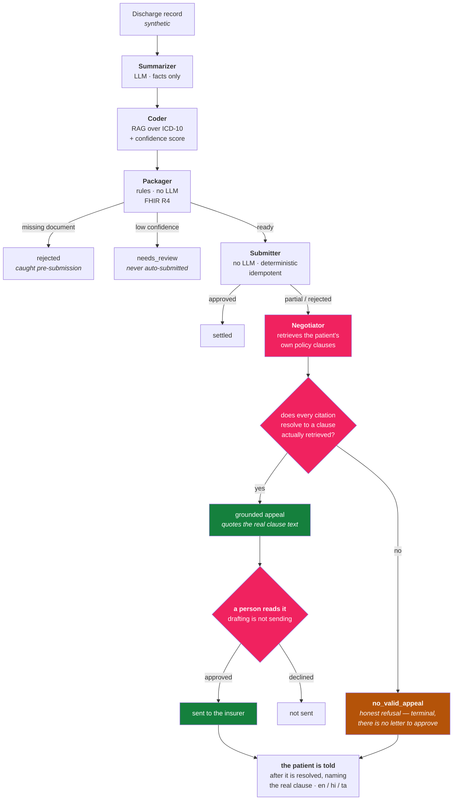

# ClaimGuard

[](https://github.com/heyitspuru/Sarge-claimGuard/actions/workflows/ci.yml)

**Drafts insurance appeals grounded in the patient's actual policy clauses — and refuses to invent one when the policy doesn't support it.**

In India, a hospital discharge becomes an insurance claim. When that claim is denied, most patients accept it — not because the denial is right, but because reading a policy document is a specialist skill they don't have. ClaimGuard reads it for them.

Solo project, **synthetic data only**, built phase-by-phase against `PROJECT_SPEC.md` under the rules in `CLAUDE.md`.

---

## How it works



**The Negotiator is the point; everything else is the plumbing it stands on.**

1. **Summarizer** turns a messy discharge record into a structured summary. Every field traces back to a source field — it may not invent clinical facts.
2. **Coder** retrieves ICD-10 candidates by embedding similarity and assigns codes *with a confidence score*. Low confidence sets `needs_review`.
3. **Packager** applies rules and builds a FHIR R4 claim. **No LLM.** A missing document or a low-confidence code stops here — neither can reach submission.
4. **Submitter** is deterministic, idempotent and has no LLM, so a retry after a dropped connection re-attaches to the original submission instead of filing a second claim. It's a labelled simulator, not real NHCX.
5. **Negotiator** fires automatically on a denial. It retrieves clauses from the patient's own policy, drafts an appeal — and then every citation the model produced is **filtered against the clauses actually retrieved**. Anything hallucinated is dropped, and the quoted text is replaced with the clause's *real* text rather than the model's rendering of it. An appeal left with no surviving citation is downgraded to `no_valid_appeal`.

6. **A person reads it.** A drafted appeal lands in `drafted` and goes nowhere until a staff member approves or declines it — an appeal is a formal communication to an insurer on someone else's behalf, so **drafting is not sending**. A `no_valid_appeal` can't be approved at all: there is no letter, and recording an approval against one would assert an appeal was on its way when nothing exists.

That grounding step is enforced **structurally, not by prompting**. The model cannot emit a citation that doesn't resolve, because the gate runs after it and discards what doesn't. `grounding_rate` is a CI gate at ≥ 0.98.

**An advocate that argues every case is worthless. The refusals are what make the appeals credible.**

### Running alongside

- **Compliance Radar** — where the time actually goes between discharge and submission, against the IRDAI baseline (1h pre-auth / 3h discharge), with a pre-breach alert at the 2-hour mark. Journeys are a *synthetic* timeline: the pipeline runs in milliseconds, so real handoff timestamps don't exist yet, and every report says so.
- **Patient comms** — plain-language status in English, Hindi or Tamil. Copy is **template-based: no model generates a patient message at runtime**. "Bad news phrased alarmingly" is a test failure under `CLAUDE.md`, and a fixed catalog stays auditable where a prompt doesn't. (The Hindi and Tamil *translations* in that catalog were model-written and are screened by blind back-translation — see below.) Pharmacy readiness fires at *order* time, never gated on the insurer.
- **The advocacy track** — the patient gets a *lead* the moment a decision lands (something came back, we're on it, nothing is needed from you) and the *full* story once it's resolved, naming the actual clause. Resolved-then-reported: a live feed of "denied" with no resolution yet is anxiety, not transparency. When the exclusion genuinely applies they're told that plainly, and still handed a next step.
- **Cross-cutting** — consent is re-checked *between* steps (a withdrawal arriving mid-claim still halts it), duplicate ABHA admissions are flagged but never blocked, and every step writes a replayable audit entry.

---

## Quickstart

```bash
python -m venv .venv
.venv/Scripts/pip install -e ".[dev]"
python -m claimguard gen-data --n 500 --golden 200 --seed 7
python -m claimguard eval --negotiation    # the grounding gate
pytest
```

`LLM_PROVIDER` defaults to `mock`, so all of the above runs offline, deterministically, with **no API key and no spend**. Set `LLM_PROVIDER=gemini` + `GEMINI_API_KEY` for real-provider runs.

See one claim travel the whole way — agents, settlement, timeline, and both surfaces:

```bash
python -m claimguard demo                    # a denied record, end to end
python -m claimguard demo --language hi      # the patient's messages in Hindi
```

Dashboard:

```bash
docker compose up -d                        # postgres + api
cd frontend && npm install && npm run dev   # http://localhost:5173
```

Two separate surfaces, each behind its own login ([`docs/AUTH.md`](docs/AUTH.md)):

- **`/hospital`** — Compliance Radar over every record. Demo staff login:
  `claims@demo-hospital.test` / `demo-claims-officer`.
- **`/patient`** — one patient's own claim, and nothing else. Sign in with any ABHA id
  or policy number **from the demo corpus** (`data/golden/*.json`), then the simulated
  OTP shown on screen.

Login is a **labelled simulator** — the OTP sends nothing, and an identifier outside the
synthetic corpus is refused by design. Never enter a real ABHA id. The UI is labelled
**SYNTHETIC DATA** throughout.

---

## Status

| Phase | Scope | |
|---|---|---|
| 0–1 | Synthetic data engine, ICD/policy corpus, thin pipeline, orchestrator + audit log | ✅ |
| 2 | **Negotiation/Appeal Agent** — clause-grounded appeals, deterministic citation gate, honest-no path | ✅ |
| 3 | Compliance Radar — journey timing vs. IRDAI baseline, React dashboard | ✅ |
| 4 | Patient comms — multilingual template-based status, patient view | ✅ |
| 5 | Hardening — all 12 §9 edge cases, resumable real eval, auto-appeal, readiness audit | 🔄 |

Suite green in CI (badge above — it runs against a real Postgres + pgvector with **no provider key**), ruff clean. The whole suite is offline on the mock by design: a test that reaches the network is itself the bug. Exact counts live in the CI run, not here — hand-copied numbers drift.

## Eval

| Metric | Value | What it means |
|---|---|---|
| `grounding_rate` | **1.000** / 48 | No citation ever failed to resolve. CI gate ≥ 0.98. |
| `packaging_validity` | **1.000** / 170 | Packager isolation gate — runs offline, no key. |
| `coding_f1` | 0.618 | Real Gemini, **n=17 of 200** — underpowered, accumulating. |

```
where coding lands:          where packaging lands:
  exact      8                 match                13
  sibling    5                 needs_review->ready   3   <-- under-flagged
  miss       4                 ready->needs_review   1
```

`sibling` = right ICD family, wrong leaf. The coder is mostly **oriented but imprecise** rather than lost — a different problem with a different fix, which a collapsed exact/miss split would hide.

**The open defect: 3 of 17 records were under-flagged** — packaged `ready` when the answer key wanted a human to see them first. The two directions are not symmetric. Over-flagging costs a reviewer's time; under-flagging is the one that can send a wrong claim, and `CLAUDE.md` treats it as a hard failure rather than a tuning parameter. It has now held near 18% across two independent batches, so it is more likely a real property of the confidence threshold than a small-sample artifact. Live numbers in [`docs/EVALUATION.md`](docs/EVALUATION.md), regenerated from the checkpoint on every run.

The free tier allows exactly **20 generate requests/day** (confirmed from the provider's quota error), i.e. 10 records/day, so the full corpus is a ~20-day accumulation. `eval --real-run` is resumable and quota-safe: records cut off by a 429 are left unrecorded for retry, and a provider limit never enters the accuracy denominator. Procedure in [`docs/EVAL_RUNBOOK.md`](docs/EVAL_RUNBOOK.md).

## What this is not

- **Not clinically validated.** Coding F1 is agreement with an *unadjudicated* synthetic answer key — no certified coder has reviewed it.
- **Not connected to real NHCX.** The Submitter is a labelled simulator; sandbox access needs organisation-level NHA onboarding ([`docs/NHCX_ACCESS.md`](docs/NHCX_ACCESS.md)).
- **Not delivering patient messages anywhere.** `channel` is a label, not a send.
- **Not native-speaker reviewed.** Hindi/Tamil copy is model-written, then screened by blind back-translation for *meaning drift* — which caught a real one: the Hindi pharmacy notice said "when to take them" (dosing) where the English said "when they are ready to collect" (pickup). Fluent, plausible, and wrong; only the round-trip exposed it ([`docs/TRANSLATION_BACKCHECK.md`](docs/TRANSLATION_BACKCHECK.md)). The screen cannot establish warmth, register or reading level — those still need a human ([`docs/TRANSLATION_VALIDATION.md`](docs/TRANSLATION_VALIDATION.md)).
- **Never touching real patient data.** Synthetic only, by design.

A full audit of what separates this from a deployable system — legal, clinical and human gates, tagged by who can actually close them — is in [**`docs/PRODUCTION_READINESS.md`**](docs/PRODUCTION_READINESS.md). Most of it isn't code.

## Docs

| | |
|---|---|
| [`PROJECT_SPEC.md`](PROJECT_SPEC.md) | The full plan and phase gates |
| [`CLAUDE.md`](CLAUDE.md) | Operating rules this repo was built under |
| [`docs/PRODUCTION_READINESS.md`](docs/PRODUCTION_READINESS.md) | What it would take to be real |
| [`docs/EVALUATION.md`](docs/EVALUATION.md) | Current numbers and where it fails (generated) |
| [`docs/EVAL_RUNBOOK.md`](docs/EVAL_RUNBOOK.md) | Reproducing the eval numbers |
| [`docs/TRANSLATION_VALIDATION.md`](docs/TRANSLATION_VALIDATION.md) | How patient copy is validated, and what that can't prove |
| [`docs/TRANSLATION_BACKCHECK.md`](docs/TRANSLATION_BACKCHECK.md) | The back-check artifact — 38 strings, every verdict |
| [`docs/DEMO_SCRIPT.md`](docs/DEMO_SCRIPT.md) | The demo walkthrough, both surfaces |
| [`docs/NHCX_ACCESS.md`](docs/NHCX_ACCESS.md) | Phase-0 reality check on submission access |
